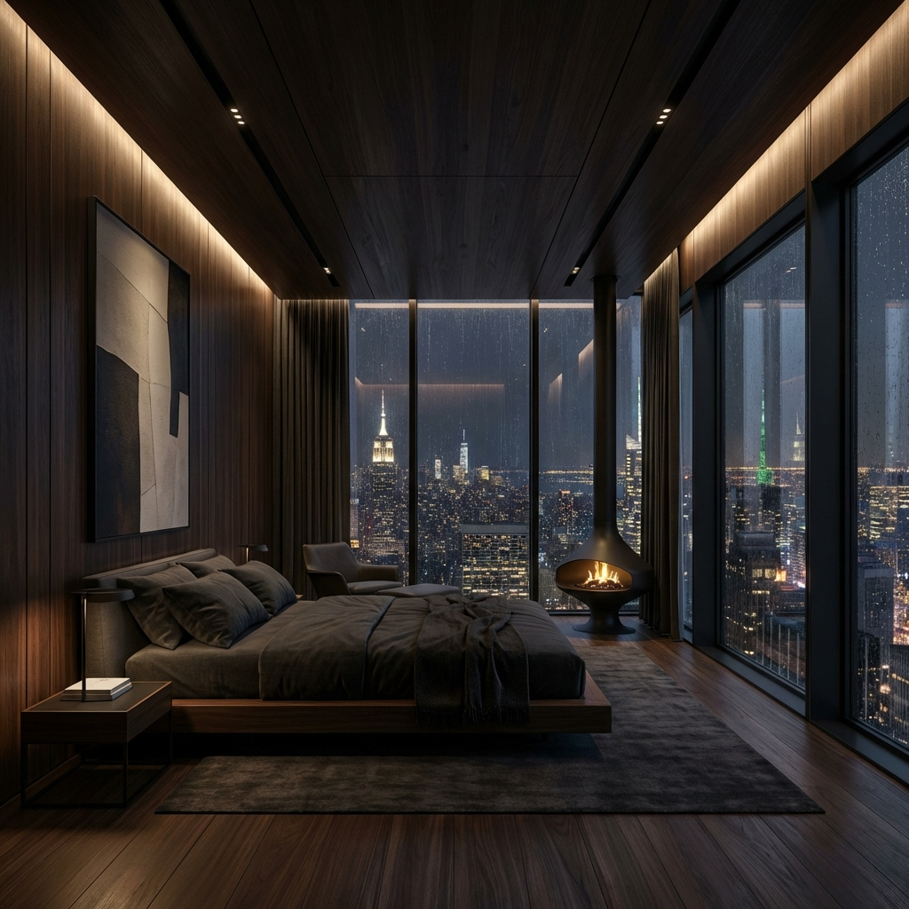

# Vista Suites — Bespoke Hospitality Design

> A premium, high-performance landing page experience for a fictional luxury hotel, showcasing advanced front-end interactions and cinematic web design.



## 💎 The Vision
Vista Suites is a study in **minimalist luxury**. The project translates a static PDF brand identity into a living digital experience. It focuses on the intersection of high-end aesthetics (typography-driven) and immersive motion design.

## 🚀 Professional Stack
*   **Vanilla JS (ES6+)*: Raw power for custom interactions without the overhead of heavy frameworks.
*   **Modern CSS**: Utilizes Grid, Flexbox, and `clamp()` for responsive fluid typography.
*   **Motion Design**: 
    *   **Custom Cursor**: A dual-circle interactive system with delayed following.
    *   **Scroll Reveals**: Staggered entry animations and image mask slides.
    *   **Hero Parallax**: 3D depth effect on scroll.
*   **Performance First**:
    *   Custom preloader system to ensure assets are ready.
    *   Optimized layout for zero Cumulative Layout Shift (CLS).
    *   Responsive image strategy.

## 🛠️ Key Technical Features
1.  **Typography System**: Integration of boutique fonts (`TAN-Mon-Cheri`) with high-accessibility system fonts.
2.  **Cinematic Motion**: Custom-built `reveal-mask` and `reveal-stagger` classes for a designer-level finish.
3.  **SEO & Social Mastery**: Full support for Open Graph tags, Twitter Cards, and semantic HTML5 structures.
4.  **Custom Interaction Layer**: A global interactive cursor that reacts to specific DOM elements.

## 📈 Performance Goals
| Metric | Score |
| :--- | :--- |
| **Performance** | 98+ |
| **Accessibility** | 100 |
| **Best Practices** | 100 |
| **SEO** | 100 |

## 📁 Repository Structure
```text
├── public/                 # Static assets (fonts, images)
├── index.html              # Core semantic structure
├── style.css               # Design system & animations
└── main.js                 # Interaction & preloader logic
```

---
*Created with a focus on premium aesthetics and technical excellence.*
